**Evaluation Report**: Group 2

Evaluator Group: [Group 5]
Project Evaluated: [Repository Group 2]
Start of assessment: [28/12/2023]
End of assessment: [05/01/2024]

## 1. Introduction

This document aims to evaluate the work developed by Group 2 of the Software Engineering course, in the context of the 2023/2024 edition, 2nd semester. The evaluation is based on the final report of the project, available at [ReportG2](group2Report.md)

## 2. Methodology:

The methodology used to evaluate the Group 2 repository was based on various technical and practical approaches:

- Reading and Investigating Each User Story: Analysing the links provided in each user story to understand the proposed functionalities.
- Testing the Server Page: Creating user accounts, posts and comments to validate the server's behaviour in relation to data creation and manipulation operations.
- Data Insertion for Statistical Purposes: The inclusion of specific data was carried out to align the system's behaviour with the description of the acceptance criteria.
- Use of DevTools to Verify Routes and Methods: Thorough analysis of the routes and methods described in the documentation using DevTools to validate the integration between the frontend and backend.
- Search for Other Selectors to Verify Functionality: Further investigation of selectors and elements in the interface in order to verify and validate the proposed functionality.
- Verification of the Backend and Alignment with the Frontend: Ensuring that the behaviour of the backend was aligned with the expectations and functionalities presented in the frontend.
- Running Tests on the Terminal to Verify Coverage.

## 3. Evaluation results:

## Error 1: Problems accessing the repository during installation
Error Description: During the repository installation process, the path to the React Script was found to be missing from the package.json file. This caused difficulties in accessing the application's frontend, jeopardising the correct initialisation of the server.
**Proposed fix:** To solve the problem, we recommend including the React Script path in the setup command. The necessary change would be to add the following command to the setup script: "setup:dev": "npm install && npm run db:create:dev && npm run migrate:dev && cd public/app && npm install". This will allow proper access to the server and ensure that the frontend works correctly.

## Error 2: Post Title Display with Long Text
Error Description: The text of a title with 85 characters exceeds the space of the div intended for it.
**Proposed fix:** Implement a line break to correctly adapt the text within the div.

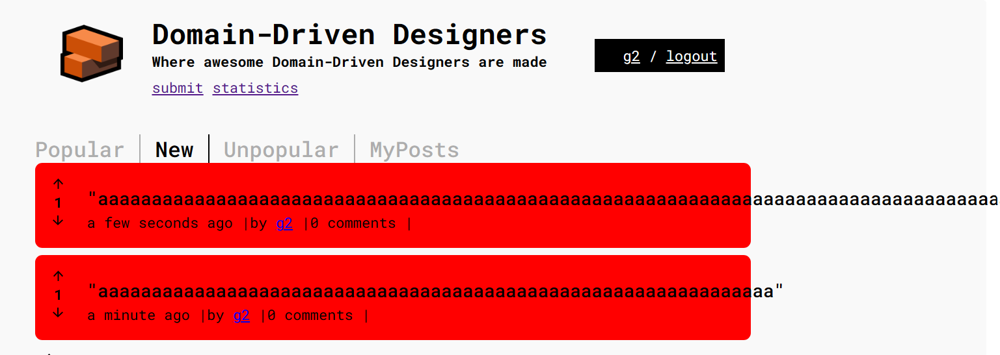

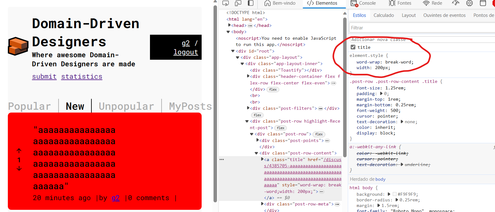

## Error 3: Image Path Problem 
Error Description: The path provided for the image in US 009 and in spritC where it deals with bugs, was incorrect, leading to a wrong reference and not displaying the correct image.
**Proposed fix:**Correct the image path to ensure correct display.

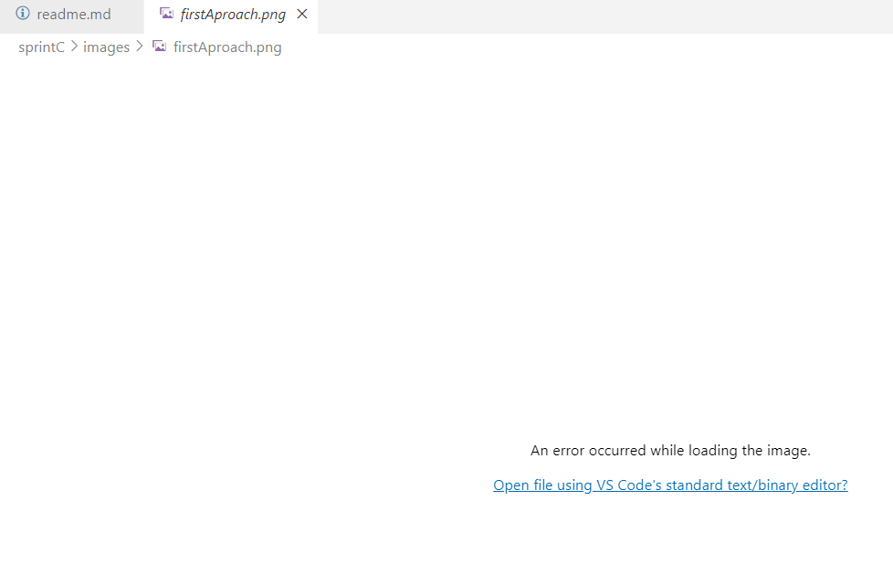

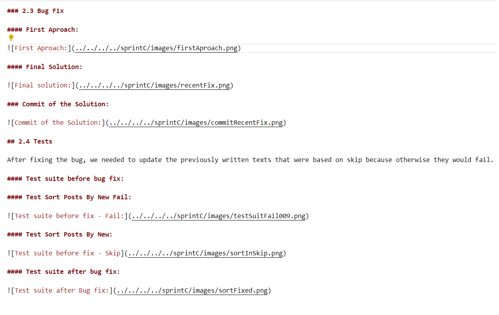 

The proposed path was looking four levels up in the folder structure, while the image was only three levels up. The correction was made by changing the path to three levels above.

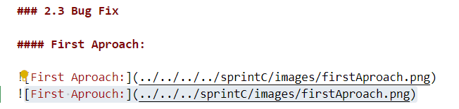

## Error 4: Inconsistency between Description and Acceptance Criteria in US 009
Error Description: The description of US 009 seems to mention the classification of posts by popularity or novelty, while the acceptance criteria refer to "unpopular" posts, causing confusion or lack of clarity in the requirements.
**Proposed Fix:** Adjust the description to explicitly reflect classification by popularity or novelty and modify the acceptance criteria to correctly align with the classification of posts.

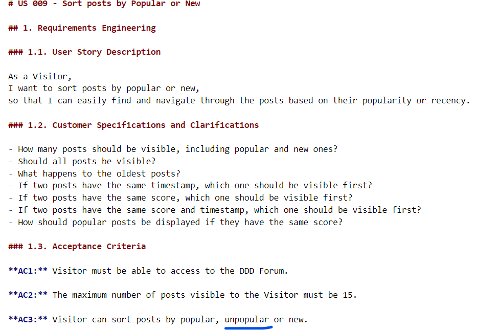

## Error 5: Missing API Route Documentation in US 014 unpopular
Error Description: The API route documentation in US 014 is missing from the Sprint B documentation details.
**Proposed Fix:** Include the route documentation in Sprint B to ensure the comprehensiveness of the information.

## Error 6: Missing Acceptance Criterion C5 in US 012 - Logout
Error Description: Lack of acceptance criterion C5 or error in the ordering of criteria in US 012, related to logout.
**Proposed Fix:** Add the missing criterion or correct the ordering of the acceptance criteria.

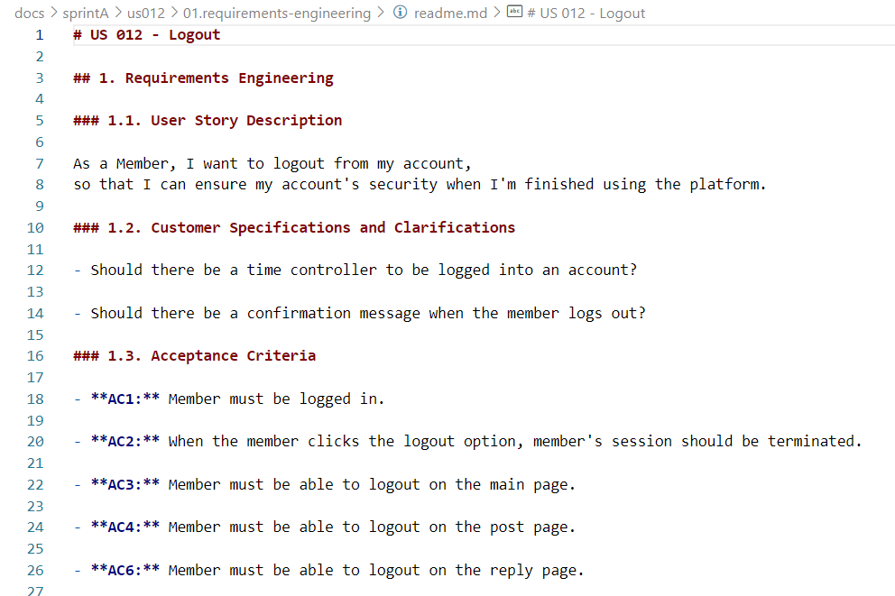

# Error 7: US 12 Acceptance criteria confused
Error description: Acceptance criteria are confused if related to purpose of logout.
**Proposed fix:** AC1: The member must be logged in; AC2: When clicking on "logout", the member's session must be terminated on all pages.
Delete redundant details. It may be unnecessary to detail where the logout can be made (main page, post page, reply page). The main focus is to ensure that the logout is effective, regardless of which page the member is on.
Clarify logout messages by reinforcing the expectation of the success message after logout ("Logged out! 🤠"), indicating that it is visual confirmation of the successful completion of the logout.

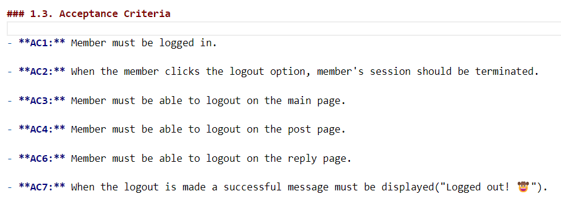

## Error 8: US 015 - The acceptance criterion inconforms with the displayed message
Error description: C5 states that: If there are no records available, the message to be displayed would be:'There is no top three for this date', whereas the message that appears when entering a date with no record is "no data found".
**Proposed fix:** Update the logic of the statistics page to display the correct message as per C5 of the user story.

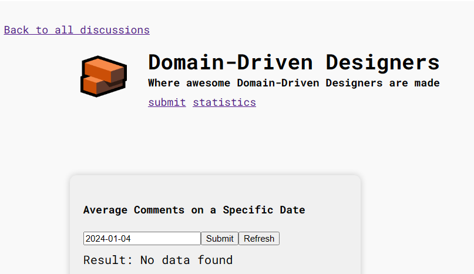

## Error 9: US 015 - Calculation of the average number of comments for a specific date. 
Error description: C2 says: The system should add up the total number of comments on that day and divide it by the number of posts or instances on that day. A test carried out on the statistics page with two posts (Post1= 0 comments, Post2= 4 comments) and a specific date (2024-01-05) returned the value 4.0, which is not the correct average. The correct average would be 2.0, because the total number of comments is 4 and the number of posts is 2, resulting in 2.0
**Proposed fix:** Adjust the logic of the function to calculate the average number of comments. It would be important to review the implementation to ensure that the acceptance criteria are being met correctly.

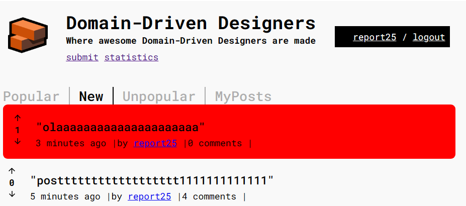

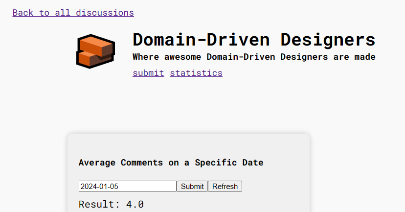

## Error 10: US 019 Test with future dates for members with no activity
Error description: future dates such as 2024-01-10, the function returned members who are logged in, this does not comply with the acceptance criteria; The functionality should identify members who had no activity (no posts or comments) on the specified date. If the date entered was in the future and the system returned members who are currently logged in, there seems to be a problem in the logic or implementation of the functionality. The expected behaviour would be that, when entering a future date, the system would simply find no users with no activity, i.e. no posts or comments up to that date. 
**Proposed fix:**Adjust the logic of the function of how the search for members without activity is being carried out. It would be important to review the implementation to ensure that the acceptance criteria are being met correctly.

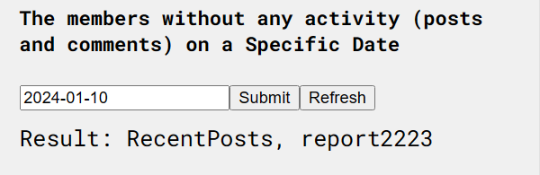

## Error 11: US 17 - Testing posts with the same number of comments
Error description: When several posts have the same maximum number of comments on a given day, the statistics show only the first post with that number of comments. This results in a limitation in the visualisation of the statistics, as other posts with the same performance are not displayed.
**Proposed fix:** Improve the statistics display logic to deal with ties in the number of comments. There are possible approaches to improving this aspect: 1. Displaying all posts; 2. Modifying the logic to show all posts that have the maximum number of comments on that date, offering a more complete view to users; 3. Tie-breaking criteria: Implement additional criteria, such as order of publication, number of likes or other relevant metrics, to break the tie between posts and choose which to display when there is a tie in the number of comments.

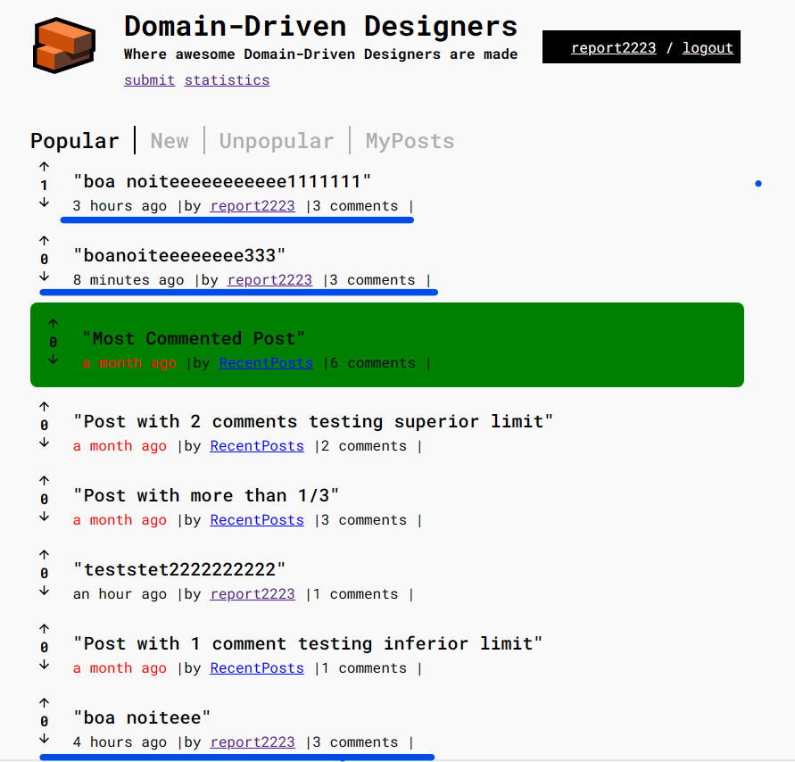

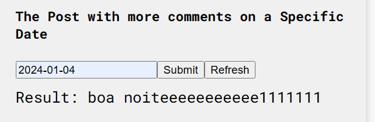

## Error 12: Sprint G - Final Report
Error description: The sprint G report that should be described as "final version" was not found in the repository;
**Proposed fix:** If the team has this report in another folder that identifies it as suggested in sprintG.

## Other findings with suggested improvements: 
1. The team opted for an initial approach of consolidating several functionalities into a single component (example: Postmeta.tsx), with a view to practicality and rapid implementation. This resulted in a robust component capable of handling various responsibilities related to displaying post metadata.
**Improvement:** Thinking about future development, it was identified that the maintenance of this single component could become complex with the increase in added functionalities and logic. It is considered that dividing this component into smaller, more focussed parts could facilitate maintenance, improve modularity and make the code more readable. 

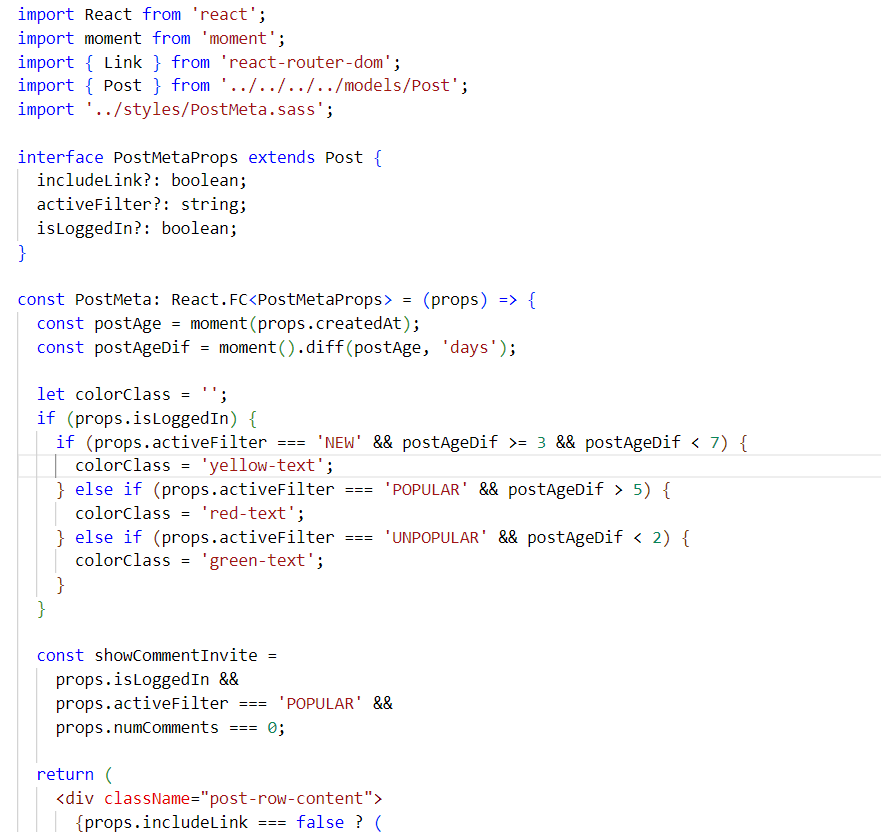

2. US with Date Insertion
USs with date insertion have a YYYY-MM-DD format, which impairs usability due to the lack of an intuitive date format.
**Improvement:** Implement a more intuitive date format, such as a calendar, to facilitate the insertion and visualisation of dates, better aligning with the purpose of the US.

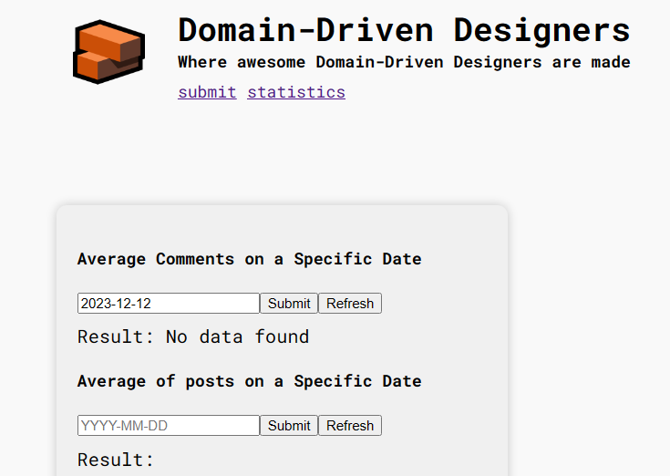

3. In us 013 delete user, following the current requirements, account deletion is not allowed if the user has active posts. Carrying out a test as a user who has submitted a post, the error message displayed (Oops' could not delete user) does not clearly explain this scenario, leaving the user without understanding the reason for the failure to delete. 
**Improvement:** Implement a clear and informative message that explains to the user why the account cannot be deleted. For example: "Deleting the account is not possible due to the existence of active posts." If the requirement says that the account cannot be deleted due to the existence of active posts, but the user still wants to delete the account, it is important to offer alternatives or options to deal with this situation.

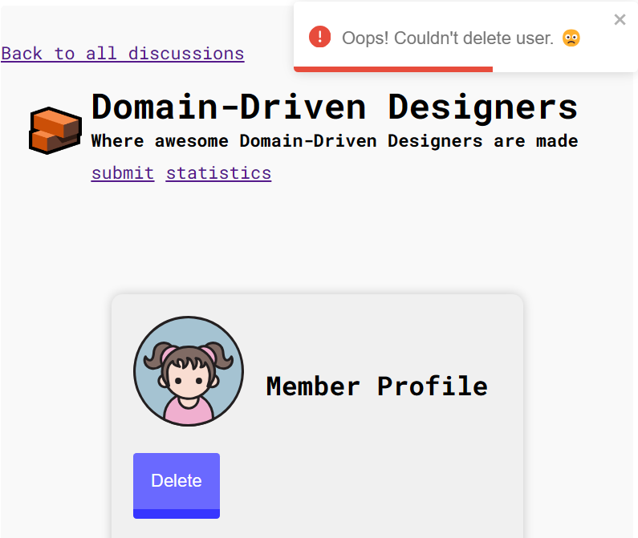

## Related to testing
With regard to the tests, some errors and inconsistencies have been identified that could be corrected to improve the quality and coverage of the tests.
The group has a total of 30 suites of tests grouped into 16 sets. Of these, 14 tests passed and 16 failed.
Individual tests performed totalled 209 tests, of which 121 passed, 83 failed and 5 were skipped.

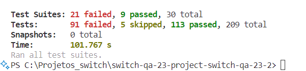

## Automation tests

**E2E**: Filter to run tests from only one US
Problem: The test repository shows several US with test scenario descriptions, but only US 22 is called when the npm run wdio test command is run. Identified filter in wdio.conf.js configuration that limits test execution to US 22 only.
**Proposed fix:** Remove the filter so that all tests are run.

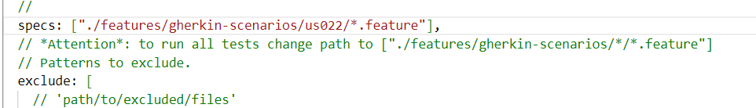

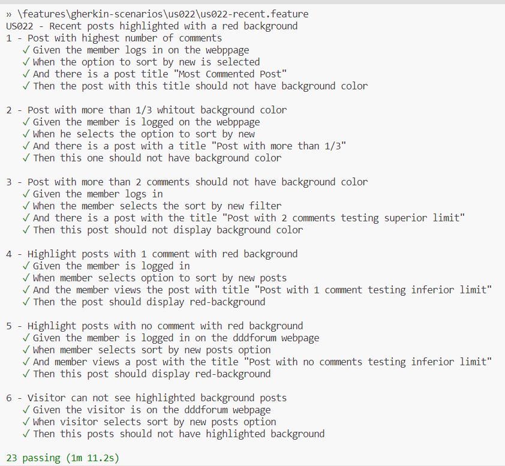

## Suggestion for improvement:
The group adopted the strategy of creating test scenarios for automation as new functionalities were implemented. However, when evaluating the repository, it was observed that many of these scenarios did not pass the tests, suggesting a practice of accumulating test cases without the proper guarantee of execution and continuous validation. Lack of attention to the real effectiveness of test scenarios can lead to an overload of unreliable tests and jeopardise the quality of the regression test suite.

Proposed fix:Continuous Testing During Development.Integrate continuous regression testing as new functionality is implemented. This means that each new test scenario should be run immediately after it is created, ensuring its effectiveness in detecting regressions and guaranteeing that it contributes to the reliable test suite. Constant Review and Validation: Promote regular review and ongoing validation of existing test scenarios. With each new feature implemented, it is necessary to validate existing test scenarios to ensure that they remain relevant and work as expected.

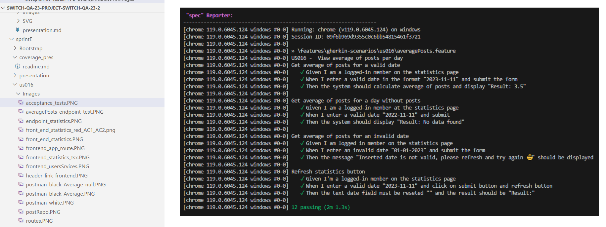

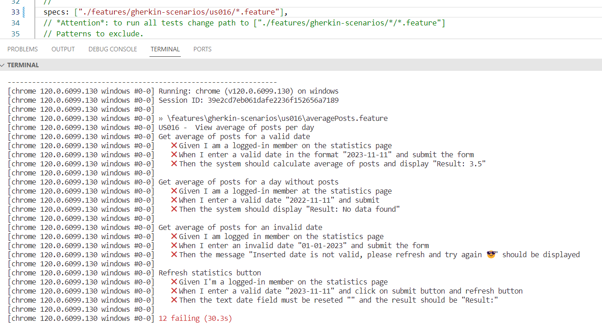

## 4. Conclusion:

The evaluation of Group 2's software repository in the Software Engineering course offered a comprehensive overview. It employed diverse evaluation techniques, highlighting strengths and areas needing enhancement.

By identifying specific errors, like the absence of React Script path and interface content display issues, the evaluation emphasized the need for crucial improvements. Addressing these errors and refining acceptance criteria are pivotal for elevating the project's quality and performance.

Moreover, recognizing gaps in automated tests underscored the importance of implementing continuous testing practices. This ensures comprehensive coverage, fortifying the software's overall quality.

While the repository showcased diverse functionalities and an inclusive development approach, it could benefit from a more modular and scalable structure for easier maintenance in the future.

Ultimately, this assessment provided valuable insights for improvement, emphasizing the importance of continuous enhancement for both individual and group development in the field of Software Engineering. Recognizing opportunities for optimization and committing to delivering high-quality software are vital for Group 2's growth and success.

